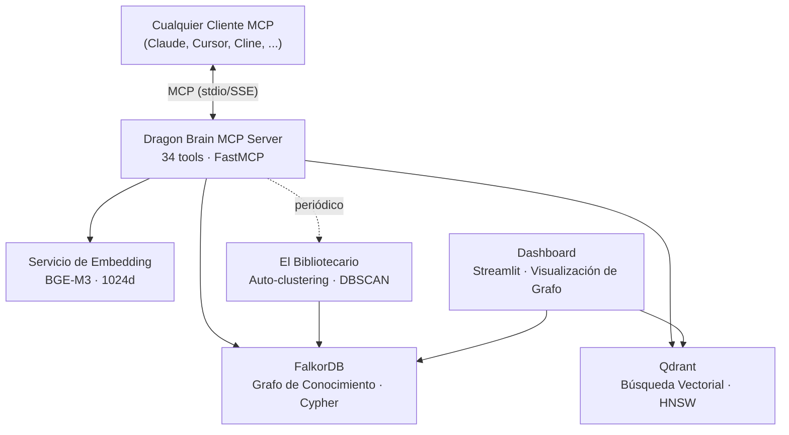

# Dragon Brain

[English](README.md) | [中文](README.zh-CN.md) | [日本語](README.ja.md) | [Español](README.es.md) | [Русский](README.ru.md) | [한국어](README.ko.md) | [Português](README.pt-BR.md) | [Deutsch](README.de.md) | [Français](README.fr.md)

**Infraestructura de memoria para agentes de IA — que falla en voz alta, por diseño.**

[](benchmarks/longmemeval/RESULTS.md)

[](LICENSE)
[](https://www.python.org/downloads/)
[](docker-compose.yml)
[]()
[]()
[-blue)]()
[]()
[](https://github.com/iikarus/Dragon-Brain/stargazers)

> **LongMemEval R@5 100%** · **34 herramientas MCP** · **Búsqueda híbrida sub-200ms** · **Contratos *fail-loud* obligatorios en CI** · **No requiere LLM**

Un servidor MCP de código abierto que proporciona memoria a largo plazo a cualquier LLM mediante un grafo de conocimiento + búsqueda vectorial híbrida. Almacena entidades, observaciones y relaciones — luego las recupera semánticamente entre sesiones. Compatible con cualquier cliente MCP: Claude Code, Claude Desktop, Cursor, Windsurf, Cline, Gemini CLI.

A diferencia del historial de chat plano o RAG simple, Dragon Brain entiende las *relaciones* entre memorias — no solo la similitud. Un agente autónomo ("El Bibliotecario") agrupa y sintetiza periódicamente las memorias en conceptos de orden superior.

**Y te dice cuando no puede recordar, en lugar de fingir que la memoria nunca estuvo ahí.**

## Inicio Rápido

> **Requisitos previos:** [Docker](https://docs.docker.com/get-docker/) y [Docker Compose](https://docs.docker.com/compose/install/).
> **Configuración detallada:** Ver [docs/SETUP.md](docs/SETUP.md) para notas específicas por plataforma y resolución de problemas.

### 1. Iniciar los Servicios

```bash
docker compose up -d
```

Esto levanta 4 contenedores:
- **FalkorDB** (grafo de conocimiento) — puerto 6379
- **Qdrant** (búsqueda vectorial) — puerto 6333
- **Embedding API** (BGE-M3, CPU por defecto) — puerto 8001
- **Dashboard** (Streamlit) — puerto 8501

> **Usuarios GPU:** `docker compose --profile gpu up -d` para aceleración NVIDIA CUDA.

Verificar que todo está saludable:
```bash
docker ps --filter "name=claude-memory"
```

### Instalar vía pip

```bash
pip install dragon-brain
```

> **Nota:** Dragon Brain requiere FalkorDB y Qdrant ejecutándose como servicios Docker.
> El paquete pip instala el servidor MCP — ejecuta `docker compose up -d` primero para la infraestructura.
> El modelo de embedding (~1GB) se sirve vía Docker, no se descarga localmente.

### 2. Conectar tu Agente de IA

**Claude Code (recomendado):**
```bash
claude mcp add dragon-brain -- python -m claude_memory.server
```

<details>
<summary><b>Claude Desktop / Otros Clientes MCP</b></summary>

Agregar a la configuración de tu cliente MCP:

```json
{
  "mcpServers": {
    "dragon-brain": {
      "command": "python",
      "args": ["-m", "claude_memory.server"],
      "env": {
        "FALKORDB_HOST": "localhost",
        "FALKORDB_PORT": "6379",
        "QDRANT_HOST": "localhost",
        "QDRANT_PORT": "6333",
        "EMBEDDING_API_URL": "http://localhost:8001"
      }
    }
  }
}
```

Ver `mcp_config.example.json` para una plantilla completa.

</details>

### 3. Empieza a Recordar

```
Tú: "Recuerda que estoy construyendo Atlas en Rust y prefiero patrones funcionales."
IA:  [crea entidad "Atlas", agrega observaciones sobre Rust y patrones funcionales]

Tú (siguiente sesión): "¿Qué sabes sobre mis proyectos?"
IA:  "Estás construyendo Atlas en Rust con un enfoque funcional..." [recuperado del grafo]
```

## Comparativa

| Característica | Historial de Chat | RAG Simple | Dragon Brain |
|---------------|:-----------------:|:----------:|:------------:|
| Persiste entre sesiones | No | Depende | **Sí** |
| Entiende relaciones | No | No | **Sí (grafo)** |
| Búsqueda semántica | No | Sí | **Sí (híbrida)** |
| Consultas temporales | No | No | **Sí** |
| Auto-clustering | No | No | **Sí (Bibliotecario)** |
| Descubrimiento de relaciones | No | No | **Sí (Radar Semántico)** |
| Funciona con cualquier cliente MCP | N/A | Varía | **Sí** |
| **Infraestructura Fail-Loud** | No | No | **Sí (Contrato `SearchError`, CI-gated)** |

## Capacidades

| Capacidad | Cómo Funciona |
|-----------|--------------|
| **Almacenar memorias** | Crea entidades (personas, proyectos, conceptos) con observaciones tipadas |
| **Búsqueda semántica** | Encuentra memorias por significado, no solo palabras clave — "eso sobre sistemas distribuidos" funciona |
| **Recorrido del grafo** | Sigue relaciones entre memorias — "¿qué está conectado al Proyecto X?" |
| **Viaje en el tiempo** | Consulta tu grafo de memoria en cualquier punto del tiempo — "¿qué sabía el martes pasado?" |
| **Auto-clustering** | Agente en segundo plano descubre patrones y crea resúmenes de conceptos |
| **Descubrimiento de relaciones** | El Radar Semántico encuentra conexiones faltantes comparando similitud vectorial con distancia en el grafo |
| **Seguimiento de sesiones** | Recuerda el contexto de conversación y avances importantes |

## Arquitectura



- **Capa de Grafo**: FalkorDB almacena entidades, relaciones y observaciones como un grafo de conocimiento consultable con Cypher
- **Capa Vectorial**: Qdrant almacena embeddings de 1024 dimensiones para búsqueda de similitud semántica
- **Búsqueda Híbrida**: Las consultas golpean ambas capas, fusionadas mediante Reciprocal Rank Fusion (RRF) con enriquecimiento por activación por propagación
- **Radar Semántico**: Descubre relaciones faltantes comparando similitud vectorial con distancia en el grafo
- **El Bibliotecario**: Agente autónomo que agrupa memorias y sintetiza conceptos de orden superior


## Herramientas MCP (Top 10)

| Herramienta | Qué Hace |
|------------|----------|
| `create_entity` | Almacena una nueva persona, proyecto, concepto o nodo tipado |
| `add_observation` | Adjunta un hecho o nota a una entidad existente |
| `search_memory` | Búsqueda híbrida semántica + grafo en todas las memorias |
| `get_hologram` | Obtiene una entidad con su contexto completo (vecinos, observaciones, relaciones) |
| `create_relationship` | Enlaza dos entidades con un arista tipada y ponderada |
| `get_neighbors` | Explora lo directamente conectado a una entidad |
| `point_in_time_query` | Consulta el grafo tal como existía en un timestamp específico |
| `record_breakthrough` | Marca un momento de aprendizaje significativo para referencia futura |
| `semantic_radar` | Descubre relaciones faltantes mediante análisis de brecha vector-grafo |
| `graph_health` | Estadísticas del grafo de memoria — conteo de nodos, densidad de aristas, huérfanos |

Las 34 herramientas están documentadas en [docs/MCP_TOOL_REFERENCE.md](docs/MCP_TOOL_REFERENCE.md).

## Por Qué Lo Construí

Claude es brillante pero olvida todo entre conversaciones. Cada nuevo chat comienza desde cero — sin contexto, sin continuidad, sin comprensión acumulada. Quería que Claude me *recordara*: mis proyectos, preferencias, avances, y las conexiones entre ellos. No un volcado plano del historial de chat, sino un grafo de conocimiento vivo que se enriquece con el tiempo.

## Forjado en la Auditoría (Forged in Audit)

La mayoría de los sistemas de memoria de código abierto pulen el "camino feliz" (happy path). Aquí está el error que Dragon Brain envió a producción durante dos meses, y la infraestructura que ahora existe para que no pueda volver a ocurrir.

### La mentira

Antes de abril de 2026, la canalización (pipeline) `search()` se veía más o menos así:

```python
try:
    # ... pipeline de recuperación de 6 canales ...
except Exception:
    return []
```

La herramienta `search_memory` de MCP luego transformaba `[]` en la cadena `"No results found."`. Claude recibía esa cadena y la trataba como definitiva — *"el usuario realmente no tiene memorias sobre este tema"* — cuando en realidad el servicio de embeddings se había caído, FalkorDB era inalcanzable, o Qdrant había agotado su tiempo de espera.

**Cada consulta degradada era la IA operando con contexto faltante sin saberlo.** Una mentira confiada, indistinguible de la vaciedad genuina, incrustada en la función más llamada del sistema.

### La solución

Una auditoría adversaria de 4 fases encontró **83 violaciones de contrato en 37 archivos fuente**. Diez lotes de correcciones se enviaron entre abril y mayo de 2026:

- La falla de la infraestructura ahora lanza un **`SearchError`** — la lista vacía significa "no se encontraron resultados", y *solo* eso.
- **MCP `search_memory`** devuelve el error estructurado `{"error": "MEMORY_LAYER_DEGRADED", "retry_safe": true}` — señalando explícitamente la degradación a la IA, y nunca una mentira confiada.
- **Compensación entre bases de datos** en crear/actualizar/eliminar entidades — si la escritura en Qdrant falla, se revierte FalkorDB para prevenir datos huérfanos.
- **La escritura de relaciones usa `MERGE`, no `CREATE`** — reintentar las llamadas a `create_relationship` no duplica los bordes.
- **Las fallas de escritura de FTS se propagan** al que llama — eliminando la obsolescencia silenciosa de los índices.
- **El administrador de bloqueos lanza `TimeoutError`** en caso de contención — nunca procede en silencio sin haber obtenido el bloqueo.
- **Las herramientas MCP tienen validación semántica** — los UUIDs incorrectos devuelven `{"error": "ENTITY_NOT_FOUND"}`, y no un resultado vacío silencioso.

### La disciplina que lo mantiene arreglado

- **`tox -e contracts`** — el bloqueo en CI (CI gate) está fijado en **13 violaciones** (bajó de 64). Las nuevas violaciones hacen fallar el build antes del merge. Las revisiones trimestrales seguirán bajando esta base hacia cero.
- **Pruebas de integración de comportamiento** — `testcontainers-python` levanta instancias reales de `falkordb/falkordb:v4.14.11` y `qdrant/qdrant:v1.16.3`, luego hace `container.kill()` a mitad de una operación para asegurar que el contrato *fail-loud* (fallar en voz alta) se mantiene de principio a fin.
- **Repositorio nativo asíncrono** — `AsyncMemoryRepository` aísla a los controladores de base de datos síncronos en grupos de hilos (thread pools) en ~75 puntos de llamada.
- **Documentación de límites de confianza** — cada límite entre procesos tiene un contrato explícito registrado en [docs/ARCHITECTURE.md](docs/ARCHITECTURE.md).

### Por qué importa

Si tu capa de memoria puede mentir sobre sus modos de fallo, cada paso de razonamiento derivado está corrupto. Los agentes de IA confían en sus herramientas. Las herramientas que fabrican resultados vacíos con confianza envenenan cadenas de razonamiento enteras.

Por lo que sabemos, Dragon Brain es el primer sistema de memoria de código abierto con un contrato obligatorio por CI para asegurar que los fallos de infraestructura no se silencien. Si alguna vez vuelve a suceder, la construcción fallará antes de fusionarse.

### Resultados (Receipts)

- **1,337 pruebas** distribuidas en 106 archivos de prueba, 0 fallos, 0 saltos
- **Pruebas de mutación** — 2,270 mutantes, 1,184 destruidos a lo largo de 27 archivos fuente (3-evil/1-sad/1-happy por función)
- **Pruebas basadas en propiedades** — 38 propiedades de Hypothesis
- **Fuzz testing** — Más de 30K inputs, 0 caídas (crashes)
- **Análisis estático** — mypy en modo estricto (0 errores), ruff (0 errores)
- **Auditoría de seguridad** — Auditoría de inyección Cypher, escaneo de credenciales
- **Detección de código muerto** — Vulture (0 hallazgos)
- **Dragon Brain Gauntlet** — 20 rondas de auditoría automatizada de calidad, **A− (95/100)**

Resultados completos del Gauntlet: [docs/GAUNTLET_RESULTS.md](docs/GAUNTLET_RESULTS.md) · Límites de confianza: [docs/ARCHITECTURE.md](docs/ARCHITECTURE.md) · Pruebas de integración: [tests/integration/test_db_kill_scenarios.py](tests/integration/test_db_kill_scenarios.py)

## Casos de Uso

- **Proyectos a largo plazo** — Acumula contexto durante semanas/meses. Dragon Brain recuerda decisiones de arquitectura, avances y el razonamiento detrás de ellos.
- **Investigación** — Crea un grafo de conocimiento persistente de papers, conceptos y conexiones. La búsqueda semántica encuentra memorias relevantes por significado, no por palabras clave.
- **Sistemas multi-agente** — Capa de memoria compartida para equipos de agentes. Los descubrimientos de un agente son inmediatamente buscables por otros.
- **Gestión del conocimiento personal** — Tu IA aprende tus preferencias, estilo de trabajo y experiencia de dominio con el tiempo.

## Resolución de Problemas

| Problema | Solución |
|----------|----------|
| Las herramientas MCP no aparecen | Los fallos MCP son **silenciosos**. Verifica `docker ps --filter "name=claude-memory"` — los 4 contenedores deben estar saludables. |
| `search_memory` devuelve vacío | Verifica que el servicio de embedding está corriendo en el puerto 8001. Comprueba `curl http://localhost:8001/health`. |
| Confusión con el nombre del grafo | El grafo de FalkorDB se llama `claude_memory` (no `dragon_brain`). Usa este nombre para consultas Cypher directas. |

Más: [docs/GOTCHAS.md](docs/GOTCHAS.md) · [docs/RUNBOOK.md](docs/RUNBOOK.md)

## Documentación

| Doc | Contenido |
|-----|-----------|
| [Manual de Usuario](docs/USER_MANUAL.md) | Cómo usar cada herramienta con ejemplos |
| [Referencia de Herramientas MCP](docs/MCP_TOOL_REFERENCE.md) | Referencia API: las 34 herramientas, parámetros, formatos de respuesta |
| [Arquitectura](docs/ARCHITECTURE.md) | Diseño del sistema, modelo de datos, diagrama de componentes |
| [Manual de Mantenimiento](docs/MAINTENANCE_MANUAL.md) | Respaldos, monitoreo, resolución de problemas |
| [Runbook](docs/RUNBOOK.md) | 10 recetas de respuesta a incidentes |
| [Inventario de Código](docs/CODE_INVENTORY.md) | Manifiesto archivo por archivo |
| [Trampas Conocidas](docs/GOTCHAS.md) | Trampas conocidas y casos borde |

## Desarrollo Local

Requiere **Python 3.12+**.

```bash
# Instalar
pip install -e ".[dev]"

# Ejecutar tests
tox -e pulse

# Ejecutar servidor localmente
python -m claude_memory.server

# Ejecutar dashboard
streamlit run src/dashboard/app.py
```

## Contribuir

Ver [CONTRIBUTING.md](CONTRIBUTING.md) para política de testing, estilo de código y cómo enviar cambios.

## Licencia

[MIT](LICENSE)
