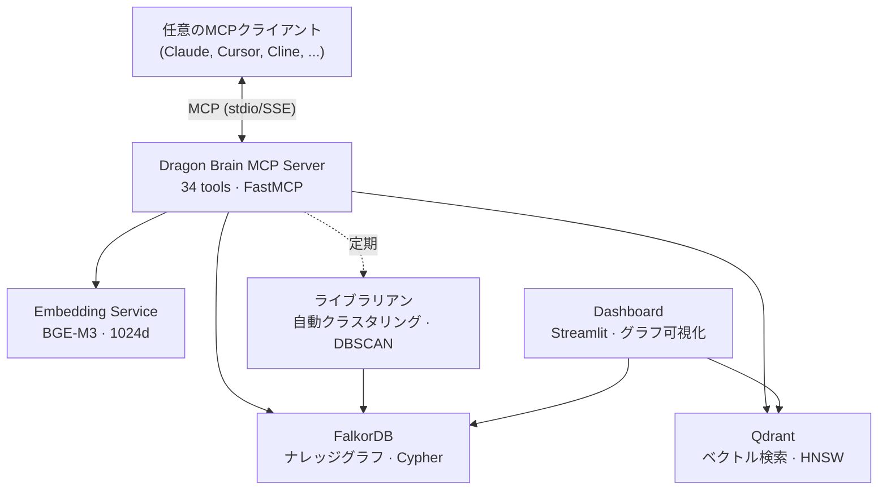

# Dragon Brain

[English](README.md) | [中文](README.zh-CN.md) | [日本語](README.ja.md) | [Español](README.es.md) | [Русский](README.ru.md) | [한국어](README.ko.md) | [Português](README.pt-BR.md) | [Deutsch](README.de.md) | [Français](README.fr.md)

**AIエージェントのための記憶インフラ — 設計から「大声で失敗する（Fail-Loud）」システム。**

[](benchmarks/longmemeval/RESULTS.md)

[](LICENSE)
[](https://www.python.org/downloads/)
[](docker-compose.yml)
[]()
[]()
[-blue)]()
[]()
[](https://github.com/iikarus/Dragon-Brain/stargazers)

> **LongMemEval R@5 100%** · **34のMCPツール** · **200ms以下のハイブリッド検索** · **CIで強制されたFail-Loud契約** · **LLM不要**

あらゆるLLMにナレッジグラフ + ベクトル検索ハイブリッドによる長期記憶を提供するオープンソースMCPサーバー。エンティティ、観察、関係を保存し、セッションをまたいでセマンティックに想起できます。すべてのMCPクライアントに対応：Claude Code、Claude Desktop、Cursor、Windsurf、Cline、Gemini CLI。

フラットなチャット履歴や単純なRAGとは異なり、Dragon Brainはメモリ間の*関係*を理解します——類似性だけではありません。自律エージェント（「ライブラリアン」）が定期的にメモリをクラスタリングし、高次の概念に統合します。

## クイックスタート

> **前提条件：** [Docker](https://docs.docker.com/get-docker/) と [Docker Compose](https://docs.docker.com/compose/install/)。
> **詳細なセットアップ：** プラットフォーム固有の注意事項とトラブルシューティングは [docs/SETUP.md](docs/SETUP.md) を参照。

### 1. サービスを起動

```bash
docker compose up -d
```

4つのコンテナが起動します：
- **FalkorDB**（ナレッジグラフ）— ポート 6379
- **Qdrant**（ベクトル検索）— ポート 6333
- **Embedding API**（BGE-M3、デフォルトCPU）— ポート 8001
- **Dashboard**（Streamlit）— ポート 8501

> **GPUユーザー：** NVIDIA CUDA アクセラレーションには `docker compose --profile gpu up -d` を使用。

すべてが正常か確認：
```bash
docker ps --filter "name=claude-memory"
```

### pipでインストール

```bash
pip install dragon-brain
```

> **注意：** Dragon BrainにはDockerサービスとしてFalkorDBとQdrantが必要です。
> pipパッケージはMCPサーバーをインストールします——先に `docker compose up -d` でインフラを起動してください。
> Embeddingモデル（約1GB）はDockerで提供され、ローカルダウンロードは不要です。

### 2. AIエージェントを接続

**Claude Code（推奨）：**
```bash
claude mcp add dragon-brain -- python -m claude_memory.server
```

<details>
<summary><b>Claude Desktop / その他のMCPクライアント</b></summary>

MCPクライアント設定に追加：

```json
{
  "mcpServers": {
    "dragon-brain": {
      "command": "python",
      "args": ["-m", "claude_memory.server"],
      "env": {
        "FALKORDB_HOST": "localhost",
        "FALKORDB_PORT": "6379",
        "QDRANT_HOST": "localhost",
        "QDRANT_PORT": "6333",
        "EMBEDDING_API_URL": "http://localhost:8001"
      }
    }
  }
}
```

完全なテンプレートは `mcp_config.example.json` を参照。

</details>

### 3. 記憶を始める

```
あなた: 「RustでAtlasというプロジェクトを作っていて、関数型パターンを好むことを覚えておいて。」
AI:    [エンティティ「Atlas」を作成、Rustと関数型パターンについての観察を追加]

あなた（次のセッション）: 「私のプロジェクトについて何を知ってる？」
AI:    「RustでAtlasを関数型アプローチで構築しています...」[グラフから想起]
```

## 比較

| 機能 | チャット履歴 | シンプルRAG | Dragon Brain |
|------|:-----------:|:----------:|:------------:|
| セッション間の永続化 | いいえ | 場合による | **はい** |
| 関係の理解 | いいえ | いいえ | **はい（グラフ）** |
| セマンティック検索 | いいえ | はい | **はい（ハイブリッド）** |
| タイムトラベルクエリ | いいえ | いいえ | **はい** |
| 自動クラスタリング | いいえ | いいえ | **はい（ライブラリアン）** |
| 関係発見 | いいえ | いいえ | **はい（セマンティックレーダー）** |
| 任意のMCPクライアント対応 | 該当なし | まちまち | **はい** |
| **Fail-Loud インフラ** | いいえ | いいえ | **はい（`SearchError`契約、CI強制）** |


## ベンチマーク

Dragon Brain は [LongMemEval](https://arxiv.org/abs/2410.10813)（ICLR 2025）で **100% recall@5** を達成しました——AI メモリシステムの業界標準ベンチマーク、500問、6カテゴリ、LLM不要。

| システム | スコア | 指標 | LLM必要 | ローカル |
|---------|:-----:|------|:---:|:---:|
| **Dragon Brain v1.2.0** | **100%** | **R@5** | **不要** | **可** |
| MemPalace (Haiku rerank) | 100% | R@5 | 必要 | 可 |
| MemPalace (raw) | 96.6% | R@5 | 不要 | 可 |
| Mem0 | ~85% | R@5 | 必要 | 不可 |

詳細な方法論と生データ：**[RESULTS.md](benchmarks/longmemeval/RESULTS.md)**

## 機能一覧

| 機能 | 仕組み |
|------|--------|
| **メモリ保存** | エンティティ（人物、プロジェクト、概念）を型付き観察とともに作成 |
| **セマンティック検索** | キーワードではなく意味でメモリを検索——「分散システムに関するあれ」でも見つかる |
| **グラフ走査** | メモリ間の関係を辿る——「プロジェクトXに関連するものは？」 |
| **タイムトラベル** | 任意の時点のメモリグラフを照会——「先週の火曜日に何を知っていた？」 |
| **自動クラスタリング** | バックグラウンドエージェントがパターンを発見し概念の要約を作成 |
| **関係発見** | セマンティックレーダーがベクトル類似度とグラフ距離を比較して欠落した接続を発見 |
| **セッション追跡** | 会話コンテキストとブレイクスルーを記憶 |

## アーキテクチャ



- **グラフ層**：FalkorDBがエンティティ、関係、観察をCypher照会可能なナレッジグラフとして格納
- **ベクトル層**：Qdrantが1024次元の埋め込みをセマンティック類似度検索用に格納
- **ハイブリッド検索**：両層にクエリを発行し、逆順位融合（RRF）と拡散活性化で結果をマージ
- **セマンティックレーダー**：ベクトル類似度とグラフ距離を比較して欠落した関係を発見
- **ライブラリアン**：メモリをクラスタリングし高次概念に統合する自律エージェント


## MCPツール（トップ10）

| ツール | 機能 |
|--------|------|
| `create_entity` | 新しい人物、プロジェクト、概念、任意の型付きノードを保存 |
| `add_observation` | 既存エンティティに事実やメモを追加 |
| `search_memory` | セマンティック + グラフのハイブリッド検索 |
| `get_hologram` | エンティティとその完全なコンテキスト（隣接、観察、関係）を取得 |
| `create_relationship` | 型付き重み付きエッジで2つのエンティティを接続 |
| `get_neighbors` | エンティティに直接接続されているものを探索 |
| `point_in_time_query` | 特定のタイムスタンプ時点のグラフを照会 |
| `record_breakthrough` | 重要な学習の瞬間を将来の参照用に記録 |
| `semantic_radar` | ベクトル-グラフギャップ分析で欠落した関係を発見 |
| `graph_health` | メモリグラフの統計——ノード数、エッジ密度、孤立ノード |

全34ツールのドキュメント：[docs/MCP_TOOL_REFERENCE.md](docs/MCP_TOOL_REFERENCE.md)

## なぜ作ったのか

Claudeは非常に賢いですが、会話の間のすべてを忘れてしまいます。新しいチャットのたびにゼロからスタート——コンテキストなし、連続性なし、蓄積された理解なし。私はClaudeに*覚えていて*ほしかった：プロジェクト、好み、ブレイクスルー、そしてそれらの間のつながりを。フラットなチャット履歴のダンプではなく、時間とともにさらに豊かになる生きたナレッジグラフを。

## 監査による鍛錬 (Forged in Audit)

ほとんどのオープンソースの記憶システムは、正常な経路（ハッピーパス）だけを磨き上げます。しかしここに、Dragon Brainが本番環境で2ヶ月間も出荷してしまったバグと、それが二度と起こらないように構築されたインフラストラクチャがあります。

### 嘘 (The lie)

2026年4月以前、`search()` パイプラインは以下のようなものでした：

```python
try:
    # ... 6チャネルの検索パイプライン ...
except Exception:
    return []
```

MCPの `search_memory` ツールはその後、`[]` を `"No results found."`（結果が見つかりません）という文字列に変換していました。Claudeはこの文字列を受け取り、権威ある事実として扱いました——*「ユーザーは確かにこのトピックについて何も記憶していない」*——しかし実際には、埋め込みサービスがクラッシュしていたり、FalkorDBに接続できなかったり、Qdrantがタイムアウトしていたりしたのです。

**劣化したクエリのたびに、AIは文脈が欠落していることを知らされないまま推論を行っていました。** これは真の「空」と区別がつかない自信満々の嘘であり、システムで最も呼び出される関数にハードコードされていました。

### 修正 (The fix)

4段階の敵対的監査により、37のソースファイルにまたがる **83の契約違反** が発見されました。2026年4月から5月にかけて、10バッチに分けて修正が出荷されました：

- インフラストラクチャの障害は現在 **`SearchError`** を発生させます——空のリストは今や「結果が見つからなかった」こと*のみ*を意味します。
- **MCP `search_memory`** は構造化された `{"error": "MEMORY_LAYER_DEGRADED", "retry_safe": true}` を返します——AIに明確に劣化を知らせ、自信満々の嘘は決して提供しません。
- データの作成/更新/削除時の**クロスストア補償**——Qdrantの書き込みに失敗した場合、FalkorDBをロールバックして孤立したデータ（スプリットブレイン）を防ぎます。
- **エッジの書き込みには `CREATE` ではなく `MERGE` を使用**——再試行された `create_relationship` 呼び出しが重複したエッジを作成しません。
- **FTS書き込みの失敗は呼び出し元に伝播**——インデックスが知らぬ間に古くなる問題を排除しました。
- **ロックマネージャーは競合時に `TimeoutError` を発生**——ロックを取得せずにサイレントに進行することは決してありません。
- **MCPツールは意味論的な検証を実施**——不正なUUIDには空の結果を黙って返すのではなく、`{"error": "ENTITY_NOT_FOUND"}` を返します。

### 規律 (The discipline)

- **`tox -e contracts`** — CIゲートのベースラインは **13の違反** にロックされています（64から減少）。新しい違反はマージ前にビルドを失敗させます。四半期ごとのレビューでこのベースラインをゼロに向けて引き下げます。
- **振る舞いの統合テスト** — `testcontainers-python` が実際の `falkordb/falkordb:v4.14.11` と `qdrant/qdrant:v1.16.3` を立ち上げ、操作の途中で `container.kill()` を実行し、エンドツーエンドのFail-Loud契約が維持されることを確認します。
- **ネイティブ非同期リポジトリ** — `AsyncMemoryRepository` は、約75の呼び出し箇所で同期的なDBドライバーをスレッドプールに隔離します。
- **信頼境界の文書化** — プロセスをまたぐすべての境界は [docs/ARCHITECTURE.md](docs/ARCHITECTURE.md) に明確な契約として記録されています。

### なぜこれが重要なのか

記憶層が自分自身の障害モードについて嘘をつくなら、下流のすべての推論ステップが汚染されます。AIエージェントはツールを信頼します。自信満々に空の結果を捏造するツールは、推論チェーン全体を毒染します。

私たちの知る限り、Dragon Brainは「大声で失敗する（fail-loud）」動作をCIで強制される契約として扱う最初のオープンソース記憶システムです。もし同じ問題が再び起きても、それはマージすらされません。

### 実績 (Receipts)

- 106のテストファイルにまたがる **1,337のテスト**、0失敗、0スキップ
- **ミューテーションテスト** — 27のソースファイルにまたがる2,270のミュータント、1,184を撃破（各関数につき3つのEvil/1つのSad/1つのHappy）
- **プロパティベーステスト** — 38のHypothesisプロパティ
- **ファジングテスト** — 3万以上の入力、0クラッシュ
- **静的解析** — mypy strict モード（0エラー）、ruff（0エラー）
- **セキュリティ監査** — Cypherインジェクション監査、クレデンシャルスキャン
- **デッドコード検出** — Vulture（0発見）
- **Dragon Brain Gauntlet** — 20ラウンドの自動品質監査、**A− (95/100)**

Gauntletの完全な結果：[docs/GAUNTLET_RESULTS.md](docs/GAUNTLET_RESULTS.md) · 信頼境界：[docs/ARCHITECTURE.md](docs/ARCHITECTURE.md) · 統合テスト：[tests/integration/test_db_kill_scenarios.py](tests/integration/test_db_kill_scenarios.py)

## ユースケース

- **長期プロジェクト** — 数週間/数ヶ月にわたってコンテキストを蓄積。Dragon Brainはアーキテクチャ決定、ブレイクスルー、その背後の推論を記憶します。
- **研究** — 論文、概念、つながりの永続的なナレッジグラフを作成。セマンティック検索がキーワードではなく意味で関連メモリを発見。
- **マルチエージェントシステム** — エージェントチームの共有メモリ層。あるエージェントの発見は即座に他のエージェントから検索可能。
- **パーソナルナレッジマネジメント** — AIが時間とともにあなたの好み、作業スタイル、ドメイン専門知識を学習。

## トラブルシューティング

| 問題 | 解決方法 |
|------|---------|
| MCPツールが表示されない | MCP障害は**サイレント**です。`docker ps --filter "name=claude-memory"` で確認——4つすべてのコンテナが正常であるべき。 |
| `search_memory` が空を返す | Embeddingサービスがポート8001で実行中か確認。`curl http://localhost:8001/health` で検証。 |
| グラフ名の混乱 | FalkorDBのグラフ名は `claude_memory`（`dragon_brain` ではない）。直接Cypherクエリにはこの名前を使用。 |

詳細：[docs/GOTCHAS.md](docs/GOTCHAS.md) · [docs/RUNBOOK.md](docs/RUNBOOK.md)

## ドキュメント

| ドキュメント | 内容 |
|------------|------|
| [ユーザーマニュアル](docs/USER_MANUAL.md) | 各ツールの使用方法と例 |
| [MCPツールリファレンス](docs/MCP_TOOL_REFERENCE.md) | APIリファレンス：全34ツール、パラメータ、レスポンス形式 |
| [アーキテクチャ](docs/ARCHITECTURE.md) | システム設計、データモデル、コンポーネント図 |
| [メンテナンスマニュアル](docs/MAINTENANCE_MANUAL.md) | バックアップ、監視、トラブルシューティング |
| [ランブック](docs/RUNBOOK.md) | 10のインシデント対応レシピ |
| [コードインベントリ](docs/CODE_INVENTORY.md) | ファイル別マニフェスト |
| [注意事項](docs/GOTCHAS.md) | 既知のトラップとエッジケース |

## ローカル開発

**Python 3.12+** が必要です。

```bash
# インストール
pip install -e ".[dev]"

# テスト実行
tox -e pulse

# サーバーをローカルで実行
python -m claude_memory.server

# ダッシュボードを実行
streamlit run src/dashboard/app.py
```

## コントリビューション

テストポリシー、コードスタイル、変更の提出方法については [CONTRIBUTING.md](CONTRIBUTING.md) を参照。

## ライセンス

[MIT](LICENSE)
