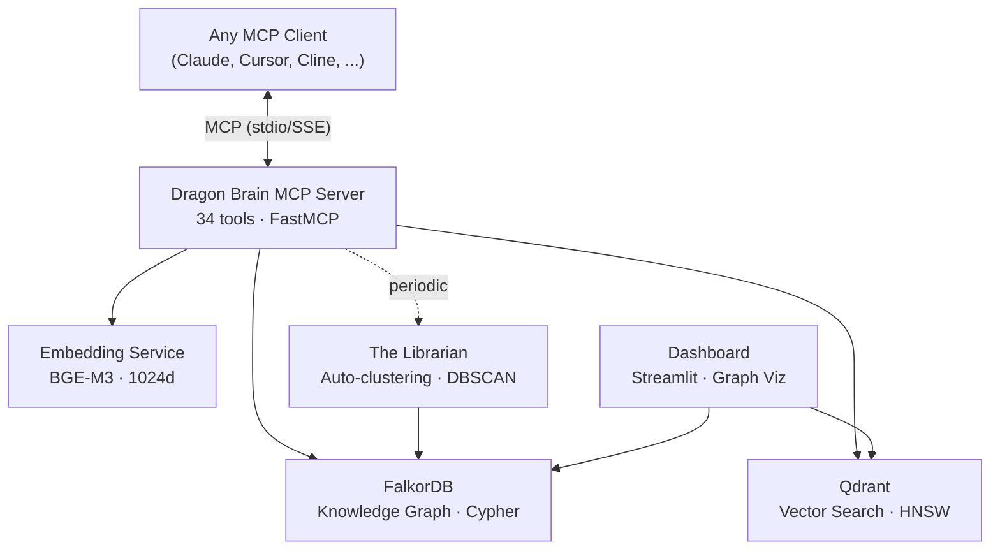

# Dragon Brain

[English](README.md) | [中文](README.zh-CN.md) | [日本語](README.ja.md) | [Español](README.es.md) | [Русский](README.ru.md) | [한국어](README.ko.md) | [Português](README.pt-BR.md) | [Deutsch](README.de.md) | [Français](README.fr.md)

**Memory infrastructure for AI agents — that fails loud, by design.**

[](benchmarks/longmemeval/RESULTS.md)

[](LICENSE)
[](https://github.com/iikarus/Dragon-Brain/actions/workflows/ci.yml)
[](https://www.python.org/downloads/)
[](docker-compose.yml)
[]()
[]()
[]()
[-blue)]()
[]()
[](https://github.com/iikarus/Dragon-Brain/stargazers)

> **100% LongMemEval R@5** · **34 MCP tools** · **sub-200ms hybrid search** · **CI-gated fail-loud contracts** · **No LLM required**

An open-source MCP server that gives any LLM long-term memory using a knowledge graph + vector search hybrid. Store entities, observations, and relationships — then recall them semantically across sessions. Works with any MCP client: Claude Code, Claude Desktop, Cursor, Windsurf, Cline, Gemini CLI, VS Code Copilot, or any LLM that speaks [Model Context Protocol](https://modelcontextprotocol.io/).

Unlike flat chat history or simple RAG, Dragon Brain understands *relationships* between memories — not just similarity. An autonomous agent ("The Librarian") periodically clusters and synthesizes memories into higher-order concepts.

**And it tells you when it can't remember — instead of pretending the memory was never there.** ([why this matters →](#forged-in-audit))


## Quick Start

> **Prerequisites:** [Docker](https://docs.docker.com/get-docker/) and [Docker Compose](https://docs.docker.com/compose/install/).
> **Detailed setup:** See [docs/SETUP.md](docs/SETUP.md) for comprehensive instructions including prerequisites, platform-specific notes, and troubleshooting.

### 1. Start the Services

```bash
docker compose up -d
```

This spins up 4 containers:
- **FalkorDB** (knowledge graph) — port 6379
- **Qdrant** (vector search) — port 6333
- **Embedding API** (BGE-M3, CPU default) — port 8001
- **Dashboard** (Streamlit) — port 8501

> **GPU users:** `docker compose --profile gpu up -d` for NVIDIA CUDA acceleration.

Verify everything is healthy:
```bash
docker ps --filter "name=claude-memory"
```

<details>
<summary><b>Alternative: Install via pip</b></summary>

```bash
pip install dragon-brain
```

> **Note:** Dragon Brain requires FalkorDB and Qdrant running as Docker services.
> The pip package installs the MCP server — run `docker compose up -d` first for the infrastructure.
> The embedding model (~1GB) is served via Docker, not downloaded locally.

</details>

### 2. Connect Your AI Agent

**Claude Code (recommended):**
```bash
claude mcp add dragon-brain -- python -m claude_memory.server
```

<details>
<summary><b>Claude Desktop / Other MCP Clients</b></summary>

Add to your MCP client config:

```json
{
  "mcpServers": {
    "dragon-brain": {
      "command": "python",
      "args": ["-m", "claude_memory.server"],
      "env": {
        "FALKORDB_HOST": "localhost",
        "FALKORDB_PORT": "6379",
        "QDRANT_HOST": "localhost",
        "QDRANT_PORT": "6333",
        "EMBEDDING_API_URL": "http://localhost:8001"
      }
    }
  }
}
```

See `mcp_config.example.json` for a full template. This server works with any MCP-compatible client via stdio transport.

</details>

### 3. Start Remembering

```
You: "Remember that I'm building Atlas in Rust and I prefer functional patterns."
AI:  [creates entity "Atlas", adds observations about Rust and functional patterns]

You (next session): "What do you know about my projects?"
AI:  "You're building Atlas in Rust with a functional approach..." [recalled from graph]
```

## What It Does

| Capability | How It Works |
|------------|-------------|
| **Store memories** | Creates entities (people, projects, concepts) with typed observations |
| **Semantic search** | Finds memories by meaning, not just keywords — "that thing about distributed systems" works |
| **Graph traversal** | Follows relationships between memories — "what's connected to Project X?" |
| **Time travel** | Queries your memory graph at any point in time — "what did I know last Tuesday?" |
| **Auto-clustering** | Background agent discovers patterns and creates concept summaries |
| **Relationship discovery** | Semantic Radar finds missing connections by comparing vector similarity against graph distance |
| **Session tracking** | Remembers conversation context and breakthroughs |

## How It Compares

| Feature | Dragon Brain | cipher | basic-memory | mcp-knowledge-graph | context-portal | nocturne_memory |
|---------|:-:|:-:|:-:|:-:|:-:|:-:|
| **Real Graph Database** | FalkorDB (Cypher) | — | — | JSON files | — | — |
| **Vector Search** | Qdrant (HNSW) | — | SQLite FTS | — | SQLite (vectors) | — |
| **Hybrid Search (RRF)** | ✓ | — | — | — | — | — |
| **Autonomous Clustering** | ✓ (DBSCAN) | — | — | — | — | — |
| **Relationship Discovery** | ✓ (Semantic Radar) | — | — | — | — | — |
| **Time Travel Queries** | ✓ | — | — | — | — | — |
| **Fail-Loud Infrastructure** | ✓ (`SearchError` contract, CI-gated) | — | — | — | — | — |
| **GPU Acceleration** | CUDA (BGE-M3) | — | — | — | — | — |
| **Typed Relationships** | Weighted edges | — | — | Edges | — | — |
| **Session Tracking** | ✓ | — | — | — | ✓ | — |
| **Model Agnostic** | Any MCP client | ✓ | ✓ | ✓ | ✓ | ✓ |
| **Test Suite** | 1,337 tests | — | — | — | — | — |
| **Mutation Testing** | ✓ | — | — | — | — | — |
| **Dashboard** | Streamlit | — | — | — | — | ✓ |
| **MCP Tools** | 34 | — | — | — | — | — |

> *Feature comparison based on public READMEs as of March 2026. Open an issue if anything is inaccurate.*

## Benchmark

Dragon Brain scores **100% recall@5** on [LongMemEval](https://arxiv.org/abs/2410.10813) (ICLR 2025), the industry-standard benchmark for AI memory systems — 500 questions across 6 categories, no LLM required for retrieval.

| System | Score | Metric | LLM Required | Local |
|--------|:-----:|--------|:---:|:---:|
| **Dragon Brain v1.2.0** | **100%** | **R@5** | **No** | **Yes** |
| MemPalace (Haiku rerank) | 100% | R@5 | Yes | Yes |
| MemPalace (raw) | 96.6% | R@5 | No | Yes |
| OMEGA | 95.4% | QA accuracy | No | Yes |
| Mastra OM | 94.87% | QA accuracy | Yes | No |
| Hindsight | 91.4% | QA accuracy | No | No |
| Mem0 | ~85% | R@5 | Yes | No |

> **Note:** R@5 (retrieval recall) and QA accuracy are different metrics — shown together for context.
> Systems marked with QA accuracy use an LLM to generate answers; R@5 measures retrieval only.
> Dragon Brain's 100% R@5 means the correct evidence sessions appear in the top 5 results for every question.

### Per-Category Breakdown

| Category | Questions | R@5 |
|----------|:---------:|:---:|
| Knowledge update | 78 | 100% |
| Multi-session | 133 | 100% |
| Temporal reasoning | 133 | 100% |
| Single-session assistant | 56 | 100% |
| Single-session preference | 30 | 100% |
| Single-session user | 70 | 100% |

### Reproduce It

```bash
pip install dragon-brain
docker compose up -d
python -m benchmarks.longmemeval.runner --dataset oracle
```

Full methodology, raw data, and the journey from 25% to 100%: **[RESULTS.md](benchmarks/longmemeval/RESULTS.md)**

## 🔥 Use Cases — See It In Action

> **Same Dragon Brain, different story.** Each demo shows a real scenario with example queries and results. [Browse all demos →](demos/)

<table>
<tr>
<td align="center" width="25%">

### ⚖️ [Legal Discovery](demos/legal-discovery/)
Find contradictions across depositions. Trace hidden money flows. Surface leads no human found.

</td>
<td align="center" width="25%">

### 🔬 [Research Lab](demos/research-lab/)
Track your lab's evolving understanding. Replay intellectual journeys. Connect papers to experiments.

</td>
<td align="center" width="25%">

### 🚀 [Startup CTO](demos/startup-cto/)
Never lose a design decision. Trace incident root causes. Onboard new engineers instantly.

</td>
<td align="center" width="25%">

### 🔍 [Investigative Journalist](demos/investigative-journalist/)
Connect the dots across sources. Detect temporal clustering. Find leads you didn't know existed.

</td>
</tr>
<tr>
<td align="center">

### 🎲 [Game Master](demos/game-master/)
Remember 50 sessions of campaign history. Trace consequences. Manage dramatic irony.

</td>
<td align="center">

### 🧠 [Personal Knowledge](demos/personal-knowledge/)
Cross-domain connections across millennia. The Zettelkasten that actually thinks.

</td>
<td align="center">

### 🛡️ [Cybersecurity SOC](demos/cybersecurity-soc/)
Link IOCs, TTPs, and actors. Detect emerging campaigns. Threat intel that connects.

</td>
<td align="center">

### 📦 [OSS Maintainer](demos/open-source-maintainer/)
3 years of issues, PRs, and RFCs — instantly searchable. Institutional knowledge preserved.

</td>
</tr>
<tr>
<td align="center">

### 📈 [Portfolio Manager](demos/portfolio-manager/)
Track theses, correlations, and lessons. Replay your mental state from 6 months ago.

</td>
<td align="center">

### 🏥 [Medical Practice](demos/medical-practice/)
Connect symptoms, treatments, and outcomes across visits. Context your EHR buries.

</td>
<td align="center">

### ⚙️ [Engineering R&D](demos/engineering-rnd/)
Trace failure modes across subsystems. Link test results to design revisions.

</td>
<td align="center">

### 📚 [Teacher](demos/teacher/) · 🎓 [Student](demos/university-student/)
Track misconceptions across cohorts. Discover cross-course concept connections.

</td>
</tr>
</table>

> **Every demo uses the exact same Dragon Brain** — no plugins, no customization, no domain-specific code. Just data + queries + connections you didn't know existed.


## Architecture



- **Graph Layer**: FalkorDB stores entities, relationships, and observations as a Cypher-queryable knowledge graph. The system is **fully async-native**, isolating synchronous database drivers in thread pools via `AsyncMemoryRepository`.
- **Vector Layer**: Qdrant stores 1024d embeddings for semantic similarity search
- **Hybrid Search**: Queries hit both layers, merged via Reciprocal Rank Fusion (RRF) with spreading activation enrichment
- **Semantic Radar**: Discovers missing relationships by comparing vector similarity against graph distance
- **The Librarian**: Autonomous agent that clusters memories and synthesizes higher-order concepts

## Project Structure

```
Dragon-Brain/
├── src/
│   ├── claude_memory/          # MCP server — 34 tools, services, repositories
│   │   ├── server.py           # FastMCP entry point
│   │   ├── tools.py            # MCP tool definitions
│   │   ├── search.py           # Hybrid search (vector + graph + RRF)
│   │   ├── repository.py       # FalkorDB graph operations
│   │   ├── vector_store.py     # Qdrant vector operations
│   │   ├── librarian.py        # Autonomous clustering agent
│   │   ├── search_advanced.py  # Semantic radar + associative search
│   │   ├── temporal.py         # Time travel queries
│   │   └── ...                 # Schema, embedding, analysis, etc.
│   └── dashboard/              # Streamlit monitoring dashboard
├── tests/
│   ├── unit/                   # 1,027 unit tests (3-evil/1-sad/1-happy per function)
│   ├── gauntlet/               # 139 mutation, fuzz, property-based, concurrency tests
│   └── integration/            # Live-container kill tests via testcontainers
├── docs/                       # Architecture, user manual, runbook, ADRs
│   └── adr/                    # 7 Architecture Decision Records
├── scripts/                    # Docker, backup, health check, e2e tests
│   └── internal/               # 27 migration, verification, and repair scripts
├── docker-compose.yml          # One-command setup (FalkorDB + Qdrant + Embeddings + Dashboard)
└── pyproject.toml              # Python 3.12+, pip install -e ".[dev]"
```

## MCP Tools (Top 10)

| Tool | What It Does |
|------|-------------|
| `create_entity` | Store a new person, project, concept, or any typed node |
| `add_observation` | Attach a fact or note to an existing entity |
| `search_memory` | Semantic + graph hybrid search across all memories |
| `get_hologram` | Get an entity with its full connected context (neighbors, observations, relationships) |
| `create_relationship` | Link two entities with a typed, weighted edge |
| `get_neighbors` | Explore what's directly connected to an entity |
| `point_in_time_query` | Query the graph as it existed at a specific timestamp |
| `record_breakthrough` | Mark a significant learning moment for future reference |
| `semantic_radar` | Discover missing relationships via vector-graph gap analysis |
| `graph_health` | Get stats on your memory graph — node counts, edge density, orphans |

All 34 tools are documented in [docs/MCP_TOOL_REFERENCE.md](docs/MCP_TOOL_REFERENCE.md).

## Forged in Audit

Most open-source memory systems polish the happy path. Here's the bug Dragon Brain shipped to production for two months — and the infrastructure that now exists so it can't come back.

### The lie

Before April 2026, the `search()` pipeline looked roughly like this:

```python
try:
    # ... 6-channel retrieval pipeline ...
except Exception:
    return []
```

The MCP `search_memory` tool then transformed `[]` into the string `"No results found."` Claude received that string and treated it as authoritative — *"the user genuinely has no memories about this topic"* — when in reality the embedding service had crashed, FalkorDB was unreachable, or Qdrant timed out.

**Every degraded query was the AI operating on missing context without knowing it.** A confident lie indistinguishable from genuine emptiness, baked into the system at its most-called function.

### The fix

A 4-phase adversarial audit found **83 contract violations across 37 source files**. Ten batches of remediation shipped between April and May 2026:

- **`SearchError`** is now raised on infrastructure failure — empty list means "no results found", *only*.
- **MCP `search_memory`** returns structured `{"error": "MEMORY_LAYER_DEGRADED", "retry_safe": true}` — surfaced to the AI as a degradation signal, never a confident lie.
- **Cross-store compensation** in entity create/update/delete — Qdrant write failure rolls back FalkorDB to prevent split-brain orphans.
- **Edge writes use `MERGE`, not `CREATE`** — retried `create_relationship` calls don't duplicate edges.
- **FTS write failures propagate** to caller receipts — silent index staleness eliminated.
- **Lock manager raises `TimeoutError`** on contention — never silently proceeds without the lock.
- **MCP tools have semantic validation** — bad UUIDs return `{"error": "ENTITY_NOT_FOUND"}`, not silent empty results.

### The discipline that keeps it fixed

- **`tox -e contracts`** — CI gate baseline-locked at **13 violations** (down from 64). New violations fail the build before merge. Quarterly reviews ratchet the baseline toward zero.
- **Behavioral integration tests** — `testcontainers-python` spins up real `falkordb/falkordb:v4.14.11` and `qdrant/qdrant:v1.16.3`, then `container.kill()` mid-operation to assert the fail-loud contract holds end-to-end.
- **Async-native repository** — `AsyncMemoryRepository` isolates synchronous DB drivers in thread pools across ~75 call sites.
- **Trust-boundary documentation** — every cross-process boundary has an explicit contract recorded in [docs/ARCHITECTURE.md](docs/ARCHITECTURE.md).

### Why it matters

If your memory layer can lie about its failure modes, every downstream reasoning step is corrupt. AI agents trust their tools. Tools that confidently fabricate empty results poison entire reasoning chains.

Dragon Brain is the first open-source memory system we know of with a CI-enforced contract that infrastructure failure cannot be silenced. If it ever happens again, the build breaks before merge.

### Receipts

- **1,337 tests** across 106 test files, 0 failures, 0 skipped
- **Mutation testing** — 2,270 mutants, 1,184 killed across 27 source files (3-evil/1-sad/1-happy per function)
- **Property-based testing** — 38 Hypothesis properties
- **Fuzz testing** — 30K+ inputs, 0 crashes
- **Static analysis** — mypy strict mode (0 errors), ruff (0 errors)
- **Security audit** — Cypher injection audit, credential scanning
- **Dead code detection** — Vulture (0 findings)
- **Dragon Brain Gauntlet** — 20-round automated quality audit, **A− (95/100)**

Full gauntlet results: [docs/GAUNTLET_RESULTS.md](docs/GAUNTLET_RESULTS.md) · Trust boundaries: [docs/ARCHITECTURE.md](docs/ARCHITECTURE.md) · Integration tests: [tests/integration/test_db_kill_scenarios.py](tests/integration/test_db_kill_scenarios.py)

## Why I Built This

Claude is brilliant but forgets everything between conversations. Every new chat starts from scratch — no context, no continuity, no accumulated understanding. I wanted Claude to *remember* me: my projects, preferences, breakthroughs, and the connections between them. Not a flat chat history dump, but a living knowledge graph that grows richer over time.

## Documentation

| Doc | What's In It |
|-----|-------------|
| [User Manual](docs/USER_MANUAL.md) | How to use each tool with examples |
| [MCP Tool Reference](docs/MCP_TOOL_REFERENCE.md) | API reference: all 34 tools, params, return shapes |
| [Architecture](docs/ARCHITECTURE.md) | System design, data model, component diagram, trust boundaries |
| [Maintenance Manual](docs/MAINTENANCE_MANUAL.md) | Backups, monitoring, troubleshooting |
| [Runbook](docs/RUNBOOK.md) | 10 incident response recipes |
| [Code Inventory](docs/CODE_INVENTORY.md) | File-by-file manifest |
| [Gotchas](docs/GOTCHAS.md) | Known traps and edge cases |

## Local Development

Requires **Python 3.12+**.

```bash
# Install
pip install -e ".[dev]"

# Run tests
tox -e pulse

# Run server locally
python -m claude_memory.server

# Run dashboard
streamlit run src/dashboard/app.py
```

### Claude Code CLI

```bash
claude mcp add dragon-brain -- python -m claude_memory.server
```

For environment variables, create a `.env` file or export them:

```bash
export FALKORDB_HOST=localhost
export FALKORDB_PORT=6379
export QDRANT_HOST=localhost
export EMBEDDING_API_URL=http://localhost:8001
```

## Troubleshooting

<details>
<summary><b>Port 6379 or 6333 already in use</b></summary>

Another service (Redis, another FalkorDB/Qdrant instance) is using the port.
Either stop the conflicting service or change the port mapping in `docker-compose.yml`:

```yaml
ports:
  - "6380:6379"  # Map to a different host port
```

Then update your environment variables to match.
</details>

<details>
<summary><b>GPU not detected / falling back to CPU</b></summary>

Ensure you're using the GPU profile: `docker compose --profile gpu up -d`

Requirements:
- NVIDIA GPU with CUDA support
- [NVIDIA Container Toolkit](https://docs.nvidia.com/datacenter/cloud-native/container-toolkit/install-guide.html) installed
- Docker configured for GPU access

CPU mode works fine for most workloads — GPU mainly speeds up bulk embedding operations.
</details>

<details>
<summary><b>MCP connection timeout in Claude Desktop</b></summary>

1. Verify all 4 containers are running: `docker ps --filter "name=claude-memory"`
2. Check the embedding API is healthy: `curl http://localhost:8001/health`
3. Ensure your `claude_desktop_config.json` paths are correct (use forward slashes)
4. Restart Claude Desktop after config changes
</details>

<details>
<summary><b>"No module named claude_memory" error</b></summary>

Install in development mode: `pip install -e .`

Or set the `PYTHONPATH` environment variable to point to the `src/` directory:
```bash
export PYTHONPATH=/path/to/Dragon-Brain/src
```
</details>

<details>
<summary><b>Memories not persisting between sessions</b></summary>

Docker volumes store persistent data. If you used `docker-compose down -v`, the
volumes were deleted. Use `docker-compose down` (without `-v`) to preserve data.

To verify data persistence:
```bash
docker exec claude-memory-mcp-graphdb-1 redis-cli GRAPH.QUERY claude_memory \
  "MATCH (n) RETURN count(n)"
```
</details>

<details>
<summary><b>Got <code>MEMORY_LAYER_DEGRADED</code> instead of results</b></summary>

This is the fail-loud contract working as designed — the memory layer detected an infrastructure failure (FalkorDB unreachable, Qdrant timeout, embedding API down) and refused to fabricate empty results.

Diagnose:
1. `docker ps --filter "name=claude-memory"` — all 4 containers should be healthy
2. `curl http://localhost:8001/health` — embedding API
3. `docker logs claude-memory-mcp-graphdb-1` — FalkorDB

Once infrastructure is healthy, retry the query. The error includes `"retry_safe": true`.
</details>

More: [docs/GOTCHAS.md](docs/GOTCHAS.md) · [docs/RUNBOOK.md](docs/RUNBOOK.md)

## Roadmap

Dragon Brain is under active development. See the [CHANGELOG](docs/CHANGELOG.md) for
recent updates.

Current focus areas:
- Native async via `falkordb.asyncio.FalkorDB` — current `asyncio.to_thread` wrapper is a correct intermediate state
- Drift detection and quality monitoring for long-lived graphs
- Search result ranking improvements
- Performance optimization for large graphs (10K+ nodes)
- Contract baseline ratchet — quarterly reduction toward zero

Have an idea? [Open an issue](https://github.com/iikarus/Dragon-Brain/issues).

## Contributing

See [CONTRIBUTING.md](CONTRIBUTING.md) for testing policy, code style, and how to submit changes.

## Community

- **Questions & Discussion**: [GitHub Discussions](https://github.com/iikarus/Dragon-Brain/discussions)
- **Bug Reports**: [GitHub Issues](https://github.com/iikarus/Dragon-Brain/issues)
- **Feature Requests**: [GitHub Issues](https://github.com/iikarus/Dragon-Brain/issues)

## License

[MIT](LICENSE)
