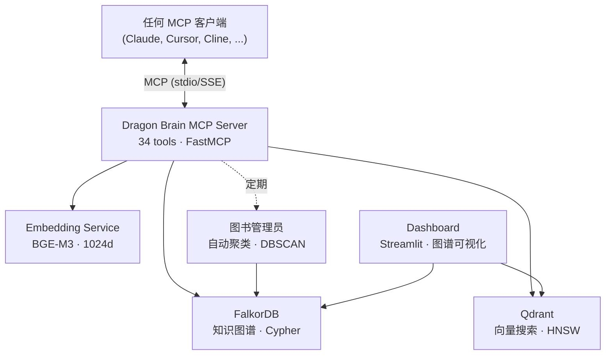

# Dragon Brain

[English](README.md) | [中文](README.zh-CN.md) | [日本語](README.ja.md) | [Español](README.es.md) | [Русский](README.ru.md) | [한국어](README.ko.md) | [Português](README.pt-BR.md) | [Deutsch](README.de.md) | [Français](README.fr.md)

**为 AI 智能体提供记忆基础设施——默认显式报错，拒绝静默失败。**

[](benchmarks/longmemeval/RESULTS.md)

[](LICENSE)
[](https://www.python.org/downloads/)
[](docker-compose.yml)
[]()
[]()
[-blue)]()
[]()
[](https://github.com/iikarus/Dragon-Brain/stargazers)

> **LongMemEval R@5 100%** · **34 个 MCP 工具** · **亚200毫秒混合搜索** · **CI强制的显式报错契约** · **无需 LLM**

一个开源 MCP 服务器，通过知识图谱 + 向量搜索混合架构为任何 LLM 提供长期记忆。存储实体、观察和关系——然后跨会话进行语义召回。兼容所有 MCP 客户端：Claude Code、Claude Desktop、Cursor、Windsurf、Cline、Gemini CLI。

不同于扁平的聊天历史或简单的 RAG，Dragon Brain 理解记忆之间的*关系*——不仅仅是相似性。自主代理（"图书管理员"）会定期聚类并合成高阶概念。

**最重要的是，当它记不起来时会明确告诉你——而不是假装记忆从未存在过。**

**最重要的是，当它记不起来时会明确告诉你——而不是假装记忆从未存在过。**

**最重要的是，当它记不起来时会明确告诉你——而不是假装记忆从未存在过。**

**最重要的是，当它记不起来时会明确告诉你——而不是假装记忆从未存在过。**

**最重要的是，当它记不起来时会明确告诉你——而不是假装记忆从未存在过。**

## 快速开始

> **前置条件：** [Docker](https://docs.docker.com/get-docker/) 和 [Docker Compose](https://docs.docker.com/compose/install/)。
> **详细设置：** 参见 [docs/SETUP.md](docs/SETUP.md) 获取平台特定说明和故障排除。

### 1. 启动服务

```bash
docker compose up -d
```

启动4个容器：
- **FalkorDB**（知识图谱）— 端口 6379
- **Qdrant**（向量搜索）— 端口 6333
- **Embedding API**（BGE-M3，默认 CPU）— 端口 8001
- **Dashboard**（Streamlit）— 端口 8501

> **GPU 用户：** 使用 `docker compose --profile gpu up -d` 启用 NVIDIA CUDA 加速。

验证所有服务健康：
```bash
docker ps --filter "name=claude-memory"
```

### 通过 pip 安装

```bash
pip install dragon-brain
```

> **注意：** Dragon Brain 需要 FalkorDB 和 Qdrant 作为 Docker 服务运行。
> pip 包安装 MCP 服务器——请先运行 `docker compose up -d` 启动基础设施。
> Embedding 模型（约1GB）通过 Docker 提供，不需要本地下载。

### 2. 连接你的 AI 智能体

**Claude Code（推荐）：**
```bash
claude mcp add dragon-brain -- python -m claude_memory.server
```

<details>
<summary><b>Claude Desktop / 其他 MCP 客户端</b></summary>

添加到你的 MCP 客户端配置：

```json
{
  "mcpServers": {
    "dragon-brain": {
      "command": "python",
      "args": ["-m", "claude_memory.server"],
      "env": {
        "FALKORDB_HOST": "localhost",
        "FALKORDB_PORT": "6379",
        "QDRANT_HOST": "localhost",
        "QDRANT_PORT": "6333",
        "EMBEDDING_API_URL": "http://localhost:8001"
      }
    }
  }
}
```

完整模板参见 `mcp_config.example.json`。

</details>

### 3. 开始记忆

```
你: "记住我正在用 Rust 构建 Atlas 项目，我偏好函数式模式。"
AI:  [创建实体 "Atlas"，添加关于 Rust 和函数式模式的观察]

你（下一次会话）: "你知道我的项目吗？"
AI:  "你正在用 Rust 构建 Atlas，采用函数式方法..." [从知识图谱召回]
```

## 竞品对比

| 特性 | 聊天历史 | 简单 RAG | Dragon Brain |
|------|:--------:|:--------:|:------------:|
| 跨会话持久化 | 否 | 视情况 | **是** |
| 理解关系 | 否 | 否 | **是（图谱）** |
| 语义搜索 | 否 | 是 | **是（混合）** |
| 时间旅行查询 | 否 | 否 | **是** |
| 自动聚类 | 否 | 否 | **是（图书管理员）** |
| 关系发现 | 否 | 否 | **是（语义雷达）** |
| 兼容任何 MCP 客户端 | 不适用 | 不一定 | **是** |
| **显式报错基础设施** | 否 | 否 | **是 (`SearchError` 契约，CI强制)** |
| **显式报错基础设施** | 否 | 否 | **是 (`SearchError` 契约，CI强制)** |
| **显式报错基础设施** | 否 | 否 | **是 (`SearchError` 契约，CI强制)** |
| **显式报错基础设施** | 否 | 否 | **是 (`SearchError` 契约，CI强制)** |
| **显式报错基础设施** | 否 | 否 | **是 (`SearchError` 契约，CI强制)** |


## 基准测试

Dragon Brain 在 [LongMemEval](https://arxiv.org/abs/2410.10813)（ICLR 2025）上取得了 **100% recall@5** 的成绩——业界标准 AI 记忆系统基准，500 个问题，6 个类别，无需 LLM。

| 系统 | 得分 | 指标 | 需要 LLM | 本地运行 |
|------|:----:|------|:---:|:---:|
| **Dragon Brain v1.2.0** | **100%** | **R@5** | **否** | **是** |
| MemPalace (Haiku rerank) | 100% | R@5 | 是 | 是 |
| MemPalace (raw) | 96.6% | R@5 | 否 | 是 |
| Mem0 | ~85% | R@5 | 是 | 否 |

完整方法论和原始数据：**[RESULTS.md](benchmarks/longmemeval/RESULTS.md)**

## 功能

| 功能 | 工作原理 |
|------|---------|
| **存储记忆** | 创建实体（人物、项目、概念）并附加类型化的观察 |
| **语义搜索** | 通过含义查找记忆，不仅仅是关键词——"那个关于分布式系统的东西"也能找到 |
| **图谱遍历** | 追踪记忆之间的关系——"与 X 项目相关的一切是什么？" |
| **时间旅行** | 查询任意时间点的记忆图谱——"上周二我知道些什么？" |
| **自动聚类** | 后台代理发现模式并创建概念摘要 |
| **关系发现** | 语义雷达通过比较向量相似度和图谱距离来发现缺失的连接 |
| **会话追踪** | 记住对话上下文和关键突破 |

## 架构



- **图谱层**：FalkorDB 将实体、关系和观察存储为可 Cypher 查询的知识图谱
- **向量层**：Qdrant 存储 1024 维嵌入用于语义相似度搜索
- **混合搜索**：查询同时命中两层，通过倒数排名融合（RRF）合并结果，并用扩散激活进行增强
- **语义雷达**：通过比较向量相似度和图谱距离来发现缺失的关系
- **图书管理员**：自主代理，聚类记忆并合成高阶概念


## MCP 工具（前 10 个）

| 工具 | 功能 |
|------|------|
| `create_entity` | 存储新的人物、项目、概念或任何类型节点 |
| `add_observation` | 为已有实体添加事实或笔记 |
| `search_memory` | 语义 + 图谱混合搜索所有记忆 |
| `get_hologram` | 获取实体及其完整上下文（邻居、观察、关系） |
| `create_relationship` | 用类型化的加权边连接两个实体 |
| `get_neighbors` | 探索与实体直接连接的内容 |
| `point_in_time_query` | 查询特定时间戳的图谱状态 |
| `record_breakthrough` | 标记重要的学习时刻以便未来参考 |
| `semantic_radar` | 通过向量-图谱差距分析发现缺失的关系 |
| `graph_health` | 获取记忆图谱的统计信息——节点数、边密度、孤岛 |

全部 34 个工具的文档见 [docs/MCP_TOOL_REFERENCE.md](docs/MCP_TOOL_REFERENCE.md)。

## 为什么我要做这个

Claude 非常聪明但会忘记对话之间的一切。每次新聊天都从零开始——没有上下文、没有连续性、没有积累的理解。我希望 Claude 能*记住*我：我的项目、偏好、突破，以及它们之间的联系。不是扁平的聊天记录导出，而是一个随时间不断丰富的活的知识图谱。

## 历经审计淬炼

大多数开源记忆系统都在粉饰“快乐路径” (happy path)。下面是 Dragon Brain 曾在生产环境中潜伏了两个月的 bug——以及现在防止它再次出现的底层基础设施。

### 谎言

在 2026 年 4 月之前，`search()` 检索流水线大致长这样：

```python
try:
    # ... 6 渠道检索流水线 ...
except Exception:
    return []
```

MCP 的 `search_memory` 工具随后会将 `[]` 转化为字符串 `"No results found."`。Claude 收到这串字符并将其视为权威事实——*“用户确实没有关于这个话题的记忆”*——而实际情况可能是 Embedding 服务崩溃了、FalkorDB 连不上、或者 Qdrant 超时了。

**每一次降级的查询，都是 AI 在不知情的情况下基于缺失的上下文进行推理。** 这是一个与真正“无结果”无法区分的自信的谎言，却被硬编码在系统调用最频繁的函数中。

### 修复

经过 4 个阶段的对抗性审计，我们在 37 个源文件中发现了 **83 处违反契约的地方**。在 2026 年 4 月至 5 月期间，我们分 10 批次发布了修复方案：

- 基础设施故障现在会抛出 **`SearchError`**——空列表如今*只*代表“未找到结果”。
- **MCP `search_memory`** 会返回结构化的 `{"error": "MEMORY_LAYER_DEGRADED", "retry_safe": true}`——向 AI 明确发出降级信号，绝不提供自信的谎言。
- 实体创建/更新/删除时的**跨存储补偿机制**——Qdrant 写入失败会回滚 FalkorDB 以防止出现脑裂孤岛。
- **边写入使用 `MERGE`，而不是 `CREATE`**——重试 `create_relationship` 调用不会产生重复的边。
- **FTS 写入失败会向调用者抛出**——消除了索引静默过时的问题。
- **锁管理器在竞争时抛出 `TimeoutError`**——绝不在未获锁的情况下静默执行。
- **MCP 工具具备语义验证**——错误的 UUID 返回 `{"error": "ENTITY_NOT_FOUND"}`，而不是静默返回空结果。

### 守住底线的纪律

- **`tox -e contracts`** — CI 门控的基准线锁定在 **13 个违规**（从 64 个降至 13 个）。新的违规会在合并前直接导致构建失败。季度审查会不断压低这个基准线直至清零。
- **行为集成测试** — `testcontainers-python` 会启动真实的 `falkordb/falkordb:v4.14.11` 和 `qdrant/qdrant:v1.16.3`，然后在操作中途执行 `container.kill()`，以确保端到端的显式报错契约得以维持。
- **原生异步仓库** — `AsyncMemoryRepository` 在约 75 个调用点将同步的数据库驱动程序隔离在线程池中。
- **信任边界文档** — 每一个跨进程边界都在 [docs/ARCHITECTURE.md](docs/ARCHITECTURE.md) 中记录了明确的契约。

### 为什么这很重要

如果你的记忆层会对自身的故障模式撒谎，那么下游的每一步推理都会被污染。AI 智能体会信任它们的工具。那些自信地捏造出空结果的工具，会毒害整个推理链条。

据我们所知，Dragon Brain 是第一个将“显式报错” (fail-loud) 作为 CI 强制契约的开源记忆系统。如果这种情况再次发生，它连合并都过不了。

### 成绩单

- 106 个测试文件中的 **1,337 个测试**，0 失败，0 跳过
- **变异测试** — 27 个源文件中的 2,270 个变异体，杀死了 1,184 个（每个函数 3恶/1悲/1喜）
- **基于属性的测试** — 38 个 Hypothesis 属性
- **模糊测试** — 30K+ 输入，0 崩溃
- **静态分析** — mypy strict 模式（0 错误），ruff（0 错误）
- **安全审计** — Cypher 注入审计，凭据扫描
- **死代码检测** — Vulture（0 发现）
- **Dragon Brain Gauntlet** — 20 轮自动化质量审计，**A− (95/100)**

完整 Gauntlet 结果：[docs/GAUNTLET_RESULTS.md](docs/GAUNTLET_RESULTS.md) · 信任边界：[docs/ARCHITECTURE.md](docs/ARCHITECTURE.md) · 集成测试：[tests/integration/test_db_kill_scenarios.py](tests/integration/test_db_kill_scenarios.py)

## 使用场景

- **长期项目** — 在数周/数月内积累上下文。Dragon Brain 记住架构决策、突破和背后的推理。
- **研究** — 创建论文、概念和连接的持久知识图谱。语义搜索通过含义而非关键词找到相关记忆。
- **多智能体系统** — 智能体团队的共享记忆层。一个智能体的发现可以立即被其他智能体搜索到。
- **个人知识管理** — 你的 AI 随时间学习你的偏好、工作风格和领域专长。

## 故障排除

| 问题 | 解决方案 |
|------|---------|
| MCP 工具未显示 | MCP 失败是**静默的**。检查 `docker ps --filter "name=claude-memory"` — 所有 4 个容器应处于健康状态。 |
| `search_memory` 返回空 | 验证 Embedding 服务在端口 8001 运行。检查 `curl http://localhost:8001/health`。 |
| 图谱名称混淆 | FalkorDB 图谱名称为 `claude_memory`（不是 `dragon_brain`）。直接 Cypher 查询时使用此名称。 |

更多：[docs/GOTCHAS.md](docs/GOTCHAS.md) · [docs/RUNBOOK.md](docs/RUNBOOK.md)

## 文档

| 文档 | 内容 |
|------|------|
| [用户手册](docs/USER_MANUAL.md) | 每个工具的使用方法和示例 |
| [MCP 工具参考](docs/MCP_TOOL_REFERENCE.md) | API 参考：全部 34 个工具、参数、返回格式 |
| [架构](docs/ARCHITECTURE.md) | 系统设计、数据模型、组件图 |
| [维护手册](docs/MAINTENANCE_MANUAL.md) | 备份、监控、故障排除 |
| [运维手册](docs/RUNBOOK.md) | 10 个事件响应方案 |
| [代码清单](docs/CODE_INVENTORY.md) | 逐文件清单 |
| [已知陷阱](docs/GOTCHAS.md) | 已知的陷阱和边界情况 |

## 本地开发

需要 **Python 3.12+**。

```bash
# 安装
pip install -e ".[dev]"

# 运行测试
tox -e pulse

# 本地运行服务器
python -m claude_memory.server

# 运行仪表盘
streamlit run src/dashboard/app.py
```

## 贡献

参见 [CONTRIBUTING.md](CONTRIBUTING.md) 了解测试策略、代码风格和如何提交更改。

## 许可证

[MIT](LICENSE)
